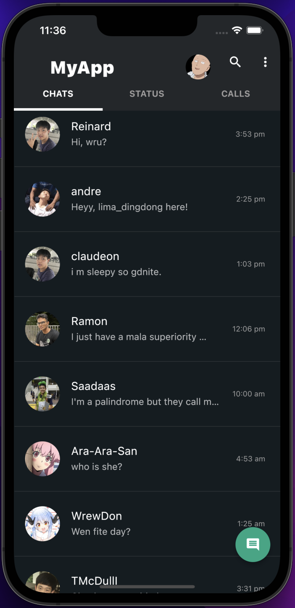
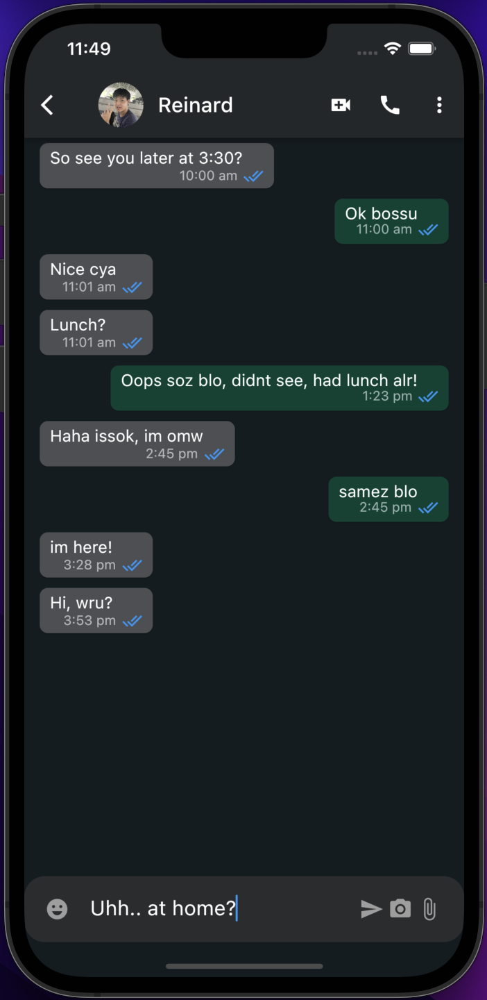

# ChatAppClone

This repository contains code for a responsive, albeit simplified, clone of a popular messaging app. Project was done with a friend while learning Flutter. See here for our full-stack IG [clone](https://github.com/claudeonrs/instagram_clone)!

## Frameworks

Front-end: Flutter
Back-end: Firebase / TBC (to be implemented.. )

**Note**: The database is currently hard-coded since Firebase has yet to be mounted. But the front-end features have been (mostly navigation aspect) implemented and functional.

## Product Showcase

### Mobile Home Screen



### Web Home Screen

**Note**: this layout is responsive, if the window is small, it transitions to mobile home screen's display.


### Chat Screen (Similar layout for both Mobile & Web)



## Installation & Usage

The front-end portion of this project can be used entirely and independently. Users can also implement their preferred backend framework for data storage & loading. A sample backend code _coming soon_!

1. Make sure you have Flutter installed: Refer to this comprehensive [installation guide](https://docs.flutter.dev/get-started/install)

2. Clone with

```
git clone https://github.com/4ndrelim/ChatAppClone.git
```

3. [Optional] (IPhone display) Install Xcode [here](https://developer.apple.com/xcode/). MacOS users should already have Xcode installed.

4. Display, at the root folder in the terminal:

   - **IPhone simulator**; run:

   ```
   $ open -a Simulator
   ```

   ```
   $ flutter run
   ```

   - **Webpage**; run:

   ```
   $ flutter run -d chrome
   ```

   or just

   ```
   $ flutter run
   ```

   and select your browser / simulator. Chrome [install](https://www.google.com/intl/en_sg/chrome/) if you wish.

   - **Android Phone**;
     connect Android phone to PC using micro USB to USB-A; run:

   ```
   flutter run
   ```

# Done by

Claudeon Reinard Susanto

[](https://github.com/claudeonrs)

&

Andre Lin

[](https://github.com/4ndrelim)
